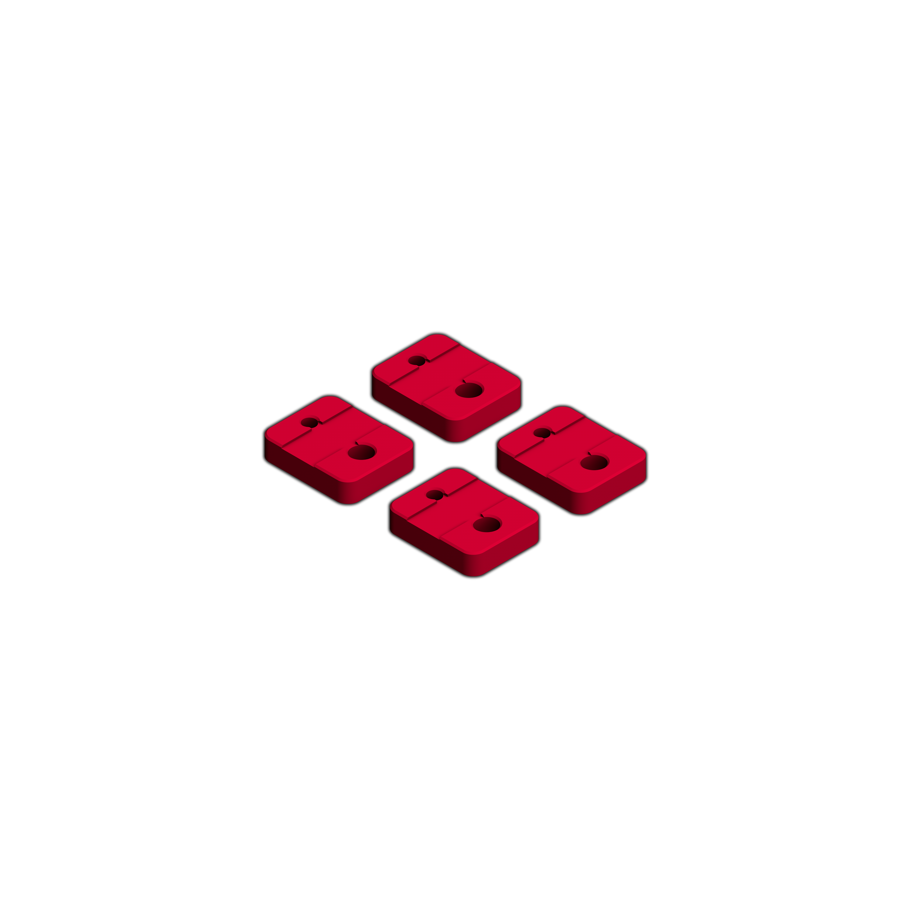
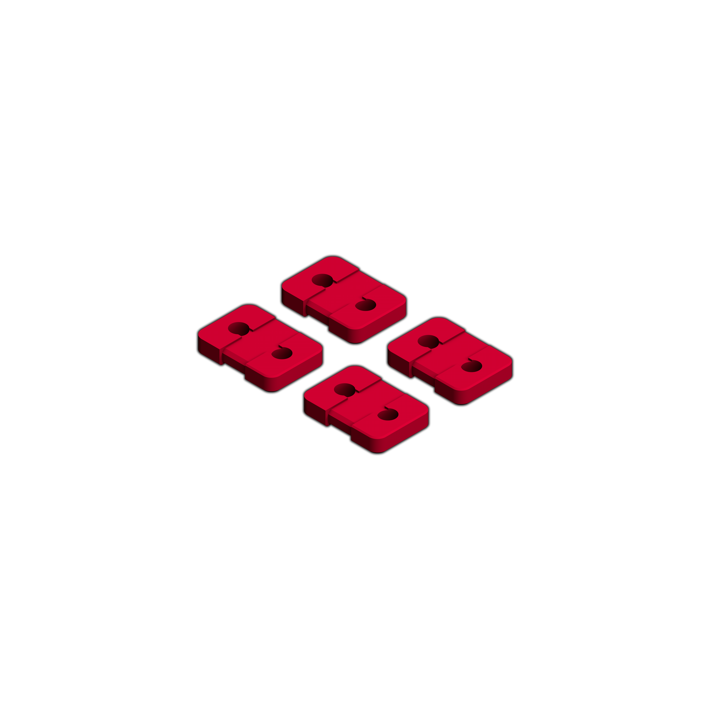

<!-- This is a reference for hopefully all printed parts needed for a function and decorated Voron 2.4 build. -->

All images:
* Resolution: 3000×3000
* Format: PNG (transparent)  

<table>
    <tr>
        <th colspan=2> CLIPS </th>
    </tr>
    <tr></tr>
    <tr>
        <td>
            <a href="https://raw.githubusercontent.com/VoronDesign/Voron-2/V2.4/STLs/VORON2.4/Gantry/%5Ba%5D_z_belt_clip_lower_x4.stl">[a]_z_belt_clip_lower_x4.stl</a>
        </td>
        <td>
            
        </td>
    </tr>
    <tr></tr>
    <tr>
        <td>
            <a href="https://raw.githubusercontent.com/VoronDesign/Voron-2/Voron2.4/STLs/VORON2.4/Gantry/%5Ba%5D_z_belt_clip_upper_x4.stl">[a]_z_belt_clip_upper_x4.stl</a>
        </td>
        <td>
            
        </td>
    </tr>
    <tr></tr>
    <tr>
        <th colspan=2> AB DRIVE UNITS </th>
    </tr>
</table>
