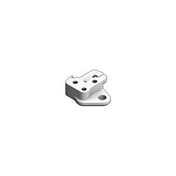
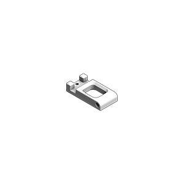

This is a reference for hopefully all printed parts needed for a functional and decorated Voron 2.4 build.
  

- [CLIPS](#clips)
    - [a]_z_belt_clip_lower_x4.stl
    - [a]_z_belt_clip_upper_x4.stl
  
- [AB DRIVE UNITS](#ab-drive-units)
    - a_drive_frame_lower.stl
    - a_drive_frame_upper.stl
    - b_drive_frame_lower.stl
    - b_drive_frame_upper.stl
    - [a]_z_chain_retainer_bracket_x2.stl
    - [a]_cable_cover.stl
  
- [FRONT IDLERS](#front-idlers)
    - front_idler_left_lower.stl
    - front_idler_left_upper.stl
    - front_idler_right_lower.stl
    - front_idler_right_upper.stl
    - [a]_tensioner_left.stl
    - [a]_tensioner_right.stl
  
- [X-CARRIAGE](#x-carriage)
    - blower_housing_rear.stl
    - hotend_fan_mount.stl
    - probe_retainer_bracket.stl
    - x_carriage_frame_left.stl
    - x_carriage_frame_right.stl
    - x_carriage_pivot_block.stl
    - [a]_belt_clamp_x2.stl
    - [a]_blower_housing_front.stl
  
- [TOOLHEAD](#toolhead)
    - printhead_front_v6.stl
    - printhead_rear_v6.stl
    - chain_anchor.stl
    - chain_anchor_10x11chains.stl
    - extruder_body.stl
    - extruder_motor_plate.stl
    - latch_shuttle.stl
    - [a]_connector_cover.stl
    - [a]_guidler.stl
    - [a]_latch.stl
  
- [XY-JOINTS](#xy-joints)
    - xy_joint_left_lower.stl
    - xy_joint_left_upper.stl
    - xy_joint_right_lower.stl
    - xy_joint_right_upper.stl
    - [a]_endstop_pod_hall_effect.stl
    - [a]_endstop_pod_microswitch.stl
    - [a]_xy_joint_cable_bridge_generic.stl
    - [a]_xy_joint_cable_bridge_igus.stl
  
- [Z-JOINTS](#z-joints)
    - z_joint_lower_x4.stl
    - z_joint_upper_x4.stl
    - z_joint_upper_hall_effect.stl
  
- [Z-DRIVE](#z-drive)
    - z_drive_main_a_x2.stl
    - z_drive_main_b_x2.stl
    - z_drive_retainer_a_x2.stl
    - z_drive_retainer_b_x2.stl
    - z_motor_mount_a_x2.stl
    - z_motor_mount_b_x2.stl
    - z_chain_bottom_anchor.stl
    - z_chain_guide.stl
    - [a]_belt_tensioner_a_x2.stl
    - [a]_belt_tensioner_b_x2.stl
    - [a]_z_drive_baseplate_a_x2.stl
    - [a]_z_drive_baseplate_b_x2.stl
  
- [Z-IDLERS](#z-idlers)
    - z_tensioner_bracket_a_x2.stl
    - z_tensioner_bracket_b_x2.stl
    - [a]_z_tensioner_x4_9mm.stl
    - [a]_z_tensioner_x4_6mm.stl
  
- [MISCELLANEOUS](#miscellaneous)
    - nozzle_probe.stl
    - rail_installation_guide_center_x2.stl
    - bowen_retainer.stl
    - spool_holder.stl
  
- [ELECTRONICS MOUNTING](#electronics-mounting)
    - plug_panel_filtered_mains.stl
    - lrs_psu_bracket_clip.stl
    - raspberrypi_bracket.stl
    - rs25_psu_bracket_clip.stl
    - pcb_din_clip_x3.stl
    - Skr_1.3_bracket_x2.stl
    - BTT Oct
  
- [PANEL MOUNTING](#panel-mounting)
    - door_hinge_x4.stl
    - handle_a_x2.stl
    - handle_b_x2.stl
    - latch_x2.stl
    - bottom_panel_clip_x4.stl
    - bottom_panel_hinge_x2.stl
    - corner_panel_clip_3mm_x12.stl
    - corner_panel_clip_6mm_x4.stl
    - midspan_panel_clip_3mm_x12.stl
    - midspan_panel_clip_6mm_x3.stl
    - z_belt_cover_a_x2.stl
    - z_belt_cover_b_x2.stl
  
- [SKIRTS](#skirts)
    - front_rear_skirt_a_350_x2.stl
    - front_rear_skirt_b_350_x2.stl
    - side_skirt_a_350_x2.stl
    - side_skirt_b_350_x2.stl
    - side_fan_support_x2.stl
    - [a]_60mm_fan_blank_insert.stl
    - [a]_belt_guard_a_x2.stl
    - [a]_belt_guard_b_x2.stl
  
- [LCD MODULE](#lcd-module)
    - mini12864_case_front.stl
    - mini12864_case_rear.stl
    - mini12864_spacer.stl
    - [a]_mini12864_case_hinge.stl

## All images

* Resolution: 3000×3000
* Format: PNG (transparent)  

## CLIPS
<table>
    <tr>
        <td>
            
        </td>
        <td width=639>
            <a href="https://raw.githubusercontent.com/jesterjunk/VoronBuildReference/VBR/printed_parts_reference/part_stls/%5Ba%5D_z_belt_clip_lower_x4.stl">[a]_z_belt_clip_lower_x4.stl</a>
        </td>
    </tr>
    <tr></tr>
    <tr>
        <td>
            
        </td>
        <td>
            <a href="https://raw.githubusercontent.com/jesterjunk/VoronBuildReference/VBR/printed_parts_reference/part_stls/%5Ba%5D_z_belt_clip_upper_x4.stl">[a]_z_belt_clip_upper_x4.stl</a>
        </td>
    </tr>
</table>

## AB DRIVE UNITS
<table>
    <tr>
        <td>
            
        </td>
        <td width=639>
            <a href="https://raw.githubusercontent.com/jesterjunk/VoronBuildReference/VBR/printed_parts_reference/part_stls/a_drive_frame_lower.stl">a_drive_frame_lower.stl</a>
        </td>
    </tr>
    <tr></tr>
    <tr>
        <td>
            
        </td>
        <td>
            <a href="https://raw.githubusercontent.com/jesterjunk/VoronBuildReference/VBR/printed_parts_reference/part_stls/a_drive_frame_upper.stl">a_drive_frame_upper.stl</a>
        </td>
    </tr>
    <tr></tr>
    <tr>
        <td>
            
        </td>
        <td>
            <a href="https://raw.githubusercontent.com/jesterjunk/VoronBuildReference/VBR/printed_parts_reference/part_stls/b_drive_frame_lower.stl">b_drive_frame_lower.stl</a>
        </td>
    </tr>
    <tr></tr>
    <tr>
        <td>
            
        </td>
        <td>
            <a href="https://raw.githubusercontent.com/jesterjunk/VoronBuildReference/VBR/printed_parts_reference/part_stls/b_drive_frame_upper.stl">b_drive_frame_upper.stl</a>
        </td>
    </tr>
    <tr></tr>
    <tr>
        <td>
            
        </td>
        <td>
            <a href="https://raw.githubusercontent.com/jesterjunk/VoronBuildReference/VBR/printed_parts_reference/part_stls/%5Ba%5D_z_chain_retainer_bracket_x2.stl">[a]_z_chain_retainer_bracket_x2.stl</a>
        </td>
    </tr>
    <tr></tr>
    <tr>
        <td>
            
        </td>
        <td>
            <a href="https://raw.githubusercontent.com/jesterjunk/VoronBuildReference/VBR/printed_parts_reference/part_stls/%5Ba%5D_cable_cover.stl">[a]_cable_cover.stl</a>
        </td>
    </tr>
</table>

## FRONT IDLERS
<table>
    <tr>
        <td>
            
        </td>
        <td width=639>
            <a href="https://raw.githubusercontent.com/jesterjunk/VoronBuildReference/VBR/printed_parts_reference/part_stls/front_idler_left_lower.stl">front_idler_left_lower.stl</a>
        </td>
    </tr>
    <tr></tr>
    <tr>
        <td>
            
        </td>
        <td>
            <a href="https://raw.githubusercontent.com/jesterjunk/VoronBuildReference/VBR/printed_parts_reference/part_stls/front_idler_left_upper.stl">front_idler_left_upper.stl</a>
        </td>
    </tr>
    <tr></tr>
    <tr>
        <td>
            
        </td>
        <td>
            <a href="https://raw.githubusercontent.com/jesterjunk/VoronBuildReference/VBR/printed_parts_reference/part_stls/front_idler_right_lower.stl">front_idler_right_lower.stl</a>
        </td>
    </tr>
    <tr></tr>
    <tr>
        <td>
            
        </td>
        <td>
            <a href="https://raw.githubusercontent.com/jesterjunk/VoronBuildReference/VBR/printed_parts_reference/part_stls/front_idler_right_upper.stl">front_idler_right_upper.stl</a>
        </td>
    </tr>
    <tr></tr>
    <tr>
        <td>
            
        </td>
        <td>
            <a href="https://raw.githubusercontent.com/jesterjunk/VoronBuildReference/VBR/printed_parts_reference/part_stls/%5Ba%5D_tensioner_left.stl">[a]_tensioner_left.stl</a>
        </td>
    </tr>
    <tr></tr>
    <tr>
        <td>
            
        </td>
        <td>
            <a href="https://raw.githubusercontent.com/jesterjunk/VoronBuildReference/VBR/printed_parts_reference/part_stls/%5Ba%5D_tensioner_right.stl">[a]_tensioner_right.stl</a>
        </td>
    </tr>
</table>

## X-CARRIAGE
<table>
    <tr>
        <td>
            
        </td>
        <td width=639>
            <a href="https://raw.githubusercontent.com/jesterjunk/VoronBuildReference/VBR/printed_parts_reference/part_stls/blower_housing_rear.stl">blower_housing_rear.stl</a>
        </td>
    </tr>
    <tr></tr>
    <tr>
        <td>
            
        </td>
        <td>
            <a href="https://raw.githubusercontent.com/jesterjunk/VoronBuildReference/VBR/printed_parts_reference/part_stls/hotend_fan_mount.stl">hotend_fan_mount.stl</a>
        </td>
    </tr>
    <tr></tr>
    <tr>
        <td>
            
        </td>
        <td>
            <a href="https://raw.githubusercontent.com/jesterjunk/VoronBuildReference/VBR/printed_parts_reference/part_stls/probe_retainer_bracket.stl">probe_retainer_bracket.stl</a>
        </td>
    </tr>
    <tr></tr>
    <tr>
        <td>
            
        </td>
        <td>
            <a href="https://raw.githubusercontent.com/jesterjunk/VoronBuildReference/VBR/printed_parts_reference/part_stls/x_carriage_frame_left.stl">x_carriage_frame_left.stl</a>
        </td>
    </tr>
    <tr></tr>
    <tr>
        <td>
            
        </td>
        <td>
            <a href="https://raw.githubusercontent.com/jesterjunk/VoronBuildReference/VBR/printed_parts_reference/part_stls/x_carriage_frame_right.stl">x_carriage_frame_right.stl</a>
        </td>
    </tr>
    <tr></tr>
    <tr>
        <td>
            
        </td>
        <td>
            <a href="https://raw.githubusercontent.com/jesterjunk/VoronBuildReference/VBR/printed_parts_reference/part_stls/x_carriage_pivot_block.stl">x_carriage_pivot_block.stl</a>
        </td>
    </tr>
    <tr></tr>
    <tr>
        <td>
            
        </td>
        <td>
            <a href="https://raw.githubusercontent.com/jesterjunk/VoronBuildReference/VBR/printed_parts_reference/part_stls/%5Ba%5D_belt_clamp_x2.stl">[a]_belt_clamp_x2.stl</a>
        </td>
    </tr>
    <tr></tr>
    <tr>
        <td>
            
        </td>
        <td>
            <a href="https://raw.githubusercontent.com/jesterjunk/VoronBuildReference/VBR/printed_parts_reference/part_stls/%5Ba%5D_blower_housing_front.stl">[a]_blower_housing_front.stl</a>
        </td>
    </tr>
</table>

## TOOLHEAD
<table>
    <tr>
        <td>
            
        </td>
        <td width=639>
            <a href="https://raw.githubusercontent.com/jesterjunk/VoronBuildReference/VBR/printed_parts_reference/part_stls/printhead_front_e3dv6.stl">printhead_front_e3dv6.stl</a>
        </td>
    </tr>
    <tr></tr>
    <tr>
        <td>
            
        </td>
        <td>
            <a href="https://raw.githubusercontent.com/jesterjunk/VoronBuildReference/VBR/printed_parts_reference/part_stls/printhead_rear_e3dv6.stl">printhead_rear_e3dv6.stl</a>
        </td>
    </tr>
    <tr></tr>
    <tr>
        <td>
            
        </td>
        <td>
            <a href="https://raw.githubusercontent.com/jesterjunk/VoronBuildReference/VBR/printed_parts_reference/part_stls/chain_anchor_igus.stl">chain_anchor_igus.stl</a>
        </td>
    </tr>
    <tr></tr>
    <tr>
        <td>
            
        </td>
        <td>
            <a href="https://raw.githubusercontent.com/jesterjunk/VoronBuildReference/VBR/printed_parts_reference/part_stls/chain_anchor_generic.stl">chain_anchor_generic.stl</a>
        </td>
    </tr>
    <tr></tr>
    <tr>
        <td>
            
        </td>
        <td>
            <a href="https://raw.githubusercontent.com/jesterjunk/VoronBuildReference/VBR/printed_parts_reference/part_stls/extruder_body.stl">extruder_body.stl</a>
        </td>
    </tr>
    <tr></tr>
    <tr>
        <td>
            
        </td>
        <td>
            <a href="https://raw.githubusercontent.com/jesterjunk/VoronBuildReference/VBR/printed_parts_reference/part_stls/extruder_motor_plate.stl">extruder_motor_plate.stl</a>
        </td>
    </tr>
    <tr></tr>
    <tr>
        <td>
            
        </td>
        <td>
            <a href="https://raw.githubusercontent.com/jesterjunk/VoronBuildReference/VBR/printed_parts_reference/part_stls/latch_shuttle.stl">latch_shuttle.stl</a>
        </td>
    </tr>
    <tr></tr>
    <tr>
        <td>
            
        </td>
        <td>
            <a href="https://raw.githubusercontent.com/jesterjunk/VoronBuildReference/VBR/printed_parts_reference/part_stls/%5Ba%5D_connector_cover.stl">[a]_connector_cover.stl</a>
        </td>
    </tr>
    <tr></tr>
    <tr>
        <td>
            
        </td>
        <td>
            <a href="https://raw.githubusercontent.com/jesterjunk/VoronBuildReference/VBR/printed_parts_reference/part_stls/%5Ba%5D_guidler.stl">[a]_guidler.stl</a>
        </td>
    </tr>
    <tr></tr>
    <tr>
        <td>
            
        </td>
        <td>
            <a href="https://raw.githubusercontent.com/jesterjunk/VoronBuildReference/VBR/printed_parts_reference/part_stls/%5Ba%5D_latch.stl">[a]_latch.stl</a>
        </td>
    </tr>
</table>

## XY-JOINTS
<table>
    <tr>
        <td>
            
        </td>
        <td width=639>
            <a href="https://raw.githubusercontent.com/jesterjunk/VoronBuildReference/VBR/printed_parts_reference/part_stls/xy_joint_left_lower.stl">xy_joint_left_lower.stl</a>
        </td>
    </tr>
    <tr></tr>
    <tr>
        <td>
            
        </td>
        <td>
            <a href="https://raw.githubusercontent.com/jesterjunk/VoronBuildReference/VBR/printed_parts_reference/part_stls/xy_joint_left_upper.stl">xy_joint_left_upper.stl</a>
        </td>
    </tr>
    <tr></tr>
    <tr>
        <td>
            
        </td>
        <td>
            <a href="https://raw.githubusercontent.com/jesterjunk/VoronBuildReference/VBR/printed_parts_reference/part_stls/xy_joint_right_lower.stl">xy_joint_right_lower.stl</a>
        </td>
    </tr>
    <tr></tr>
    <tr>
        <td>
            
        </td>
        <td>
            <a href="https://raw.githubusercontent.com/jesterjunk/VoronBuildReference/VBR/printed_parts_reference/part_stls/xy_joint_right_upper.stl">xy_joint_right_upper.stl</a>
        </td>
    </tr>
    <tr></tr>
    <tr>
        <td>
            
        </td>
        <td>
            <a href="https://raw.githubusercontent.com/jesterjunk/VoronBuildReference/VBR/printed_parts_reference/part_stls/%5Ba%5D_endstop_pod_hall_effect.stl">[a]_endstop_pod_hall_effect.stl</a>
        </td>
    </tr>
    <tr></tr>
    <tr>
        <td>
            
        </td>
        <td>
            <a href="https://raw.githubusercontent.com/jesterjunk/VoronBuildReference/VBR/printed_parts_reference/part_stls/%5Ba%5D_endstop_pod_microswitch.stl">[a]_endstop_pod_microswitch.stl</a>
        </td>
    </tr>
    <tr></tr>
    <tr>
        <td>
            
        </td>
        <td>
            <a href="https://raw.githubusercontent.com/jesterjunk/VoronBuildReference/VBR/printed_parts_reference/part_stls/%5Ba%5D_xy_joint_cable_bridge_generic.stl">[a]_xy_joint_cable_bridge_generic.stl</a>
        </td>
    </tr>
    <tr></tr>
    <tr>
        <td>
            
        </td>
        <td>
            <a href="https://raw.githubusercontent.com/jesterjunk/VoronBuildReference/VBR/printed_parts_reference/part_stls/%5Ba%5D_xy_joint_cable_bridge_igus.stl">[a]_xy_joint_cable_bridge_igus.stl</a>
        </td>
    </tr>
</table>

## Z-JOINTS
<table>
    <tr>
        <td>
            
        </td>
        <td width=639>
            <a href="https://raw.githubusercontent.com/jesterjunk/VoronBuildReference/VBR/printed_parts_reference/part_stls/z_joint_lower_x4.stl">z_joint_lower_x4.stl</a>
        </td>
    </tr>
    <tr></tr>
    <tr>
        <td>
            
        </td>
        <td>
            <a href="https://raw.githubusercontent.com/jesterjunk/VoronBuildReference/VBR/printed_parts_reference/part_stls/z_joint_upper_x4.stl">z_joint_upper_x4.stl</a>
        </td>
    </tr>
    <tr></tr>
    <tr>
        <td>
            
        </td>
        <td>
            <a href="https://raw.githubusercontent.com/jesterjunk/VoronBuildReference/VBR/printed_parts_reference/part_stls/z_joint_upper_hall_effect.stl">z_joint_upper_hall_effect.stl</a>
        </td>
    </tr>
</table>

## Z-DRIVE
<table>
    <tr>
        <td>
            
        </td>
        <td width=639>
            <a href="https://raw.githubusercontent.com/jesterjunk/VoronBuildReference/VBR/printed_parts_reference/part_stls/z_drive_main_a_x2.stl">z_drive_main_a_x2.stl</a>
        </td>
    </tr>
    <tr></tr>
    <tr>
        <td>
            
        </td>
        <td>
            <a href="https://raw.githubusercontent.com/jesterjunk/VoronBuildReference/VBR/printed_parts_reference/part_stls/z_drive_main_b_x2.stl">z_drive_main_b_x2.stl</a>
        </td>
    </tr>
    <tr></tr>
    <tr>
        <td>
            
        </td>
        <td>
            <a href="https://raw.githubusercontent.com/jesterjunk/VoronBuildReference/VBR/printed_parts_reference/part_stls/z_drive_retainer_a_x2.stl">z_drive_retainer_a_x2.stl</a>
        </td>
    </tr>
    <tr></tr>
    <tr>
        <td>
            
        </td>
        <td>
            <a href="https://raw.githubusercontent.com/jesterjunk/VoronBuildReference/VBR/printed_parts_reference/part_stls/z_drive_retainer_b_x2.stl">z_drive_retainer_b_x2.stl</a>
        </td>
    </tr>
    <tr></tr>
    <tr>
        <td>
            
        </td>
        <td>
            <a href="https://raw.githubusercontent.com/jesterjunk/VoronBuildReference/VBR/printed_parts_reference/part_stls/z_motor_mount_a_x2.stl">z_motor_mount_a_x2.stl</a>
        </td>
    </tr>
    <tr></tr>
    <tr>
        <td>
            
        </td>
        <td>
            <a href="https://raw.githubusercontent.com/jesterjunk/VoronBuildReference/VBR/printed_parts_reference/part_stls/z_motor_mount_b_x2.stl">z_motor_mount_b_x2.stl</a>
        </td>
    </tr>
    <tr></tr>
    <tr>
        <td>
            
        </td>
        <td>
            <a href="https://raw.githubusercontent.com/jesterjunk/VoronBuildReference/VBR/printed_parts_reference/part_stls/z_chain_bottom_anchor.stl">z_chain_bottom_anchor.stl</a>
        </td>
    </tr>
    <tr></tr>
    <tr>
        <td>
            
        </td>
        <td>
            <a href="https://raw.githubusercontent.com/jesterjunk/VoronBuildReference/VBR/printed_parts_reference/part_stls/z_chain_guide.stl">z_chain_guide.stl</a>
        </td>
    </tr>
    <tr></tr>
    <tr>
        <td>
            
        </td>
        <td>
            <a href="https://raw.githubusercontent.com/jesterjunk/VoronBuildReference/VBR/printed_parts_reference/part_stls/%5Ba%5D_belt_tensioner_a_x2.stl">[a]_belt_tensioner_a_x2.stl</a>
        </td>
    </tr>
    <tr></tr>
    <tr>
        <td>
            
        </td>
        <td>
            <a href="https://raw.githubusercontent.com/jesterjunk/VoronBuildReference/VBR/printed_parts_reference/part_stls/%5Ba%5D_belt_tensioner_b_x2.stl">[a]_belt_tensioner_b_x2.stl</a>
        </td>
    </tr>
    <tr></tr>
    <tr>
        <td>
            
        </td>
        <td>
            <a href="https://raw.githubusercontent.com/jesterjunk/VoronBuildReference/VBR/printed_parts_reference/part_stls/%5Ba%5D_z_drive_baseplate_a_x2.stl">[a]_z_drive_baseplate_a_x2.stl</a>
        </td>
    </tr>
    <tr></tr>
    <tr>
        <td>
            
        </td>
        <td>
            <a href="https://raw.githubusercontent.com/jesterjunk/VoronBuildReference/VBR/printed_parts_reference/part_stls/%5Ba%5D_z_drive_baseplate_b_x2.stl">[a]_z_drive_baseplate_b_x2.stl</a>
        </td>
    </tr>
</table>

## Z-IDLERS
<table>
    <tr>
        <td>
            
        </td>
        <td width=639>
            <a href="https://raw.githubusercontent.com/jesterjunk/VoronBuildReference/VBR/printed_parts_reference/part_stls/z_tensioner_bracket_a_x2.stl">z_tensioner_bracket_a_x2.stl</a>
        </td>
    </tr>
    <tr></tr>
    <tr>
        <td>
            
        </td>
        <td>
            <a href="https://raw.githubusercontent.com/jesterjunk/VoronBuildReference/VBR/printed_parts_reference/part_stls/z_tensioner_bracket_b_x2.stl">z_tensioner_bracket_b_x2.stl</a>
        </td>
    </tr>
    <tr></tr>
    <tr>
        <td>
            
        </td>
        <td>
            <a href="https://raw.githubusercontent.com/jesterjunk/VoronBuildReference/VBR/printed_parts_reference/part_stls/%5Ba%5D_z_tensioner_x4_9mm.stl">[a]_z_tensioner_x4_9mm.stl</a>
        </td>
    </tr>
    <tr></tr>
    <tr>
        <td>
            
        </td>
        <td>
            <a href="https://raw.githubusercontent.com/jesterjunk/VoronBuildReference/VBR/printed_parts_reference/part_stls/%5Ba%5D_z_tensioner_x4_6mm.stl">[a]_z_tensioner_x4_6mm.stl</a>
        </td>
    </tr>
</table>

## MISCELLANEOUS
<table>
    <tr>
        <td>
            
        </td>
        <td width=639>
            <a href="https://raw.githubusercontent.com/jesterjunk/VoronBuildReference/VBR/printed_parts_reference/part_stls/nozzle_probe.stl">nozzle_probe.stl</a>
        </td>
    </tr>
    <tr></tr>
    <tr>
        <td>
            
        </td>
        <td>
            <a href="https://raw.githubusercontent.com/jesterjunk/VoronBuildReference/VBR/printed_parts_reference/part_stls/rail_installation_guide_center_x2.stl">rail_installation_guide_center_x2.stl</a>
        </td>
    </tr>
    <tr></tr>
    <tr>
        <td>
            
        </td>
        <td>
            <a href="https://raw.githubusercontent.com/jesterjunk/VoronBuildReference/VBR/printed_parts_reference/part_stls/bowen_retainer.stl">bowen_retainer.stl</a>
        </td>
    </tr>
    <tr></tr>
    <tr>
        <td>
            
        </td>
        <td>
            <a href="https://raw.githubusercontent.com/jesterjunk/VoronBuildReference/VBR/printed_parts_reference/part_stls/spool_holder.stl">spool_holder.stl</a>
        </td>
    </tr>
</table>

## ELECTRONICS MOUNTING
<table>
    <tr>
        <td>
            
        </td>
        <td width=639>
            <a href="https://raw.githubusercontent.com/jesterjunk/VoronBuildReference/VBR/printed_parts_reference/part_stls/plug_panel_filtered_mains.stl">plug_panel_filtered_mains.stl</a>
        </td>
    </tr>
    <tr></tr>
    <tr>
        <td>
            
        </td>
        <td>
            <a href="https://raw.githubusercontent.com/jesterjunk/VoronBuildReference/VBR/printed_parts_reference/part_stls/lrs_psu_bracket_clip.stl">lrs_psu_bracket_clip.stl</a>
        </td>
    </tr>
    <tr></tr>
    <tr>
        <td>
            
        </td>
        <td>
            <a href="https://raw.githubusercontent.com/jesterjunk/VoronBuildReference/VBR/printed_parts_reference/part_stls/raspberrypi_bracket.stl">raspberrypi_bracket.stl</a>
        </td>
    </tr>
    <tr></tr>
    <tr>
        <td>
            
        </td>
        <td>
            <a href="https://raw.githubusercontent.com/jesterjunk/VoronBuildReference/VBR/printed_parts_reference/part_stls/rs25_psu_bracket_clip.stl">rs25_psu_bracket_clip.stl</a>
        </td>
    </tr>
    <tr></tr>
    <tr>
        <td>
            
        </td>
        <td>
            <a href="https://raw.githubusercontent.com/jesterjunk/VoronBuildReference/VBR/printed_parts_reference/part_stls/pcb_din_clip_x3.stl">pcb_din_clip_x3.stl</a>
        </td>
    </tr>
    <tr></tr>
    <tr>
        <td>
            
        </td>
        <td>
            <a href="https://raw.githubusercontent.com/jesterjunk/VoronBuildReference/VBR/printed_parts_reference/part_stls/skr_1.3_bracket_x2.stl">skr_1.3_bracket_x2.stl</a>
        </td>
    </tr>
    <tr></tr>
    <tr>
        <td>
            BTT Oct
        </td>
        <td>
            BTT Oct
        </td>
    </tr>
</table>

## PANEL MOUNTING
<table>
    <tr>
        <td>
            
        </td>
        <td width=639>
            <a href="https://raw.githubusercontent.com/jesterjunk/VoronBuildReference/VBR/printed_parts_reference/part_stls/door_hinge_x4.stl">door_hinge_x4.stl</a>
        </td>
    </tr>
    <tr></tr>
    <tr>
        <td>
            
        </td>
        <td>
            <a href="https://raw.githubusercontent.com/jesterjunk/VoronBuildReference/VBR/printed_parts_reference/part_stls/handle_a_x2.stl">handle_a_x2.stl</a>
        </td>
    </tr>
    <tr></tr>
    <tr>
        <td>
            
        </td>
        <td>
            <a href="https://raw.githubusercontent.com/jesterjunk/VoronBuildReference/VBR/printed_parts_reference/part_stls/handle_b_x2.stl">handle_b_x2.stl</a>
        </td>
    </tr>
    <tr></tr>
    <tr>
        <td>
            
        </td>
        <td>
            <a href="https://raw.githubusercontent.com/jesterjunk/VoronBuildReference/VBR/printed_parts_reference/part_stls/latch_x2.stl">latch_x2.stl</a>
        </td>
    </tr>
    <tr></tr>
    <tr>
        <td>
            
        </td>
        <td>
            <a href="https://raw.githubusercontent.com/jesterjunk/VoronBuildReference/VBR/printed_parts_reference/part_stls/bottom_panel_clip_x4.stl">bottom_panel_clip_x4.stl</a>
        </td>
    </tr>
    <tr></tr>
    <tr>
        <td>
            
        </td>
        <td>
            <a href="https://raw.githubusercontent.com/jesterjunk/VoronBuildReference/VBR/printed_parts_reference/part_stls/bottom_panel_hinge_x2.stl">bottom_panel_hinge_x2.stl</a>
        </td>
    </tr>
    <tr></tr>
    <tr>
        <td>
            
        </td>
        <td>
            <a href="https://raw.githubusercontent.com/jesterjunk/VoronBuildReference/VBR/printed_parts_reference/part_stls/corner_panel_clip_3mm_x12.stl">corner_panel_clip_3mm_x12.stl</a>
        </td>
    </tr>
    <tr></tr>
    <tr>
        <td>
            
        </td>
        <td>
            <a href="https://raw.githubusercontent.com/jesterjunk/VoronBuildReference/VBR/printed_parts_reference/part_stls/corner_panel_clip_6mm_x4.stl">corner_panel_clip_6mm_x4.stl</a>
        </td>
    </tr>
    <tr></tr>
    <tr>
        <td>
            
        </td>
        <td>
            <a href="https://raw.githubusercontent.com/jesterjunk/VoronBuildReference/VBR/printed_parts_reference/part_stls/midspan_panel_clip_3mm_x12.stl">midspan_panel_clip_3mm_x12.stl</a>
        </td>
    </tr>
    <tr></tr>
    <tr>
        <td>
            
        </td>
        <td>
            <a href="https://raw.githubusercontent.com/jesterjunk/VoronBuildReference/VBR/printed_parts_reference/part_stls/midspan_panel_clip_6mm_x3.stl">midspan_panel_clip_6mm_x3.stl</a>
        </td>
    </tr>
    <tr></tr>
    <tr>
        <td>
            
        </td>
        <td>
            <a href="https://raw.githubusercontent.com/jesterjunk/VoronBuildReference/VBR/printed_parts_reference/part_stls/z_belt_cover_a_x2.stl">z_belt_cover_a_x2.stl</a>
        </td>
    </tr>
    <tr></tr>
    <tr>
        <td>
            
        </td>
        <td>
            <a href="https://raw.githubusercontent.com/jesterjunk/VoronBuildReference/VBR/printed_parts_reference/part_stls/z_belt_cover_b_x2.stl">z_belt_cover_b_x2.stl</a>
        </td>
    </tr>
</table>

## SKIRTS
<table>
    <tr>
        <td>
            
        </td>
        <td width=639>
            <a href="https://raw.githubusercontent.com/jesterjunk/VoronBuildReference/VBR/printed_parts_reference/part_stls/front_rear_skirt_a_350_x2.stl">front_rear_skirt_a_350_x2.stl</a>
        </td>
    </tr>
    <tr></tr>
    <tr>
        <td>
            
        </td>
        <td>
            <a href="https://raw.githubusercontent.com/jesterjunk/VoronBuildReference/VBR/printed_parts_reference/part_stls/front_rear_skirt_b_350_x2.stl">front_rear_skirt_b_350_x2.stl</a>
        </td>
    </tr>
    <tr></tr>
    <tr>
        <td>
            
        </td>
        <td>
            <a href="https://raw.githubusercontent.com/jesterjunk/VoronBuildReference/VBR/printed_parts_reference/part_stls/side_skirt_a_350_x2.stl">side_skirt_a_350_x2.stl</a>
        </td>
    </tr>
    <tr></tr>
    <tr>
        <td>
            
        </td>
        <td>
            <a href="https://raw.githubusercontent.com/jesterjunk/VoronBuildReference/VBR/printed_parts_reference/part_stls/side_skirt_b_350_x2.stl">side_skirt_b_350_x2.stl</a>
        </td>
    </tr>
    <tr></tr>
    <tr>
        <td>
            
        </td>
        <td>
            <a href="https://raw.githubusercontent.com/jesterjunk/VoronBuildReference/VBR/printed_parts_reference/part_stls/side_fan_support_x2.stl">side_fan_support_x2.stl</a>
        </td>
    </tr>
    <tr></tr>
    <tr>
        <td>
            
        </td>
        <td>
            <a href="https://raw.githubusercontent.com/jesterjunk/VoronBuildReference/VBR/printed_parts_reference/part_stls/%5Ba%5D_60mm_fan_blank_insert.stl">[a]_60mm_fan_blank_insert.stl</a>
        </td>
    </tr>
    <tr></tr>
    <tr>
        <td>
            
        </td>
        <td>
            <a href="https://raw.githubusercontent.com/jesterjunk/VoronBuildReference/VBR/printed_parts_reference/part_stls/%5Ba%5D_belt_guard_a_x2.stl">[a]_belt_guard_a_x2.stl</a>
        </td>
    </tr>
    <tr></tr>
    <tr>
        <td>
            
        </td>
        <td>
            <a href="https://raw.githubusercontent.com/jesterjunk/VoronBuildReference/VBR/printed_parts_reference/part_stls/%5Ba%5D_belt_guard_b_x2.stl">[a]_belt_guard_b_x2.stl</a>
        </td>
    </tr>
</table>

## LCD MODULE
<table>
    <tr>
        <td>
            
        </td>
        <td width=639>
            <a href="https://raw.githubusercontent.com/jesterjunk/VoronBuildReference/VBR/printed_parts_reference/part_stls/mini12864_case_front.stl">mini12864_case_front.stl</a>
        </td>
    </tr>
    <tr></tr>
    <tr>
        <td>
            
        </td>
        <td>
            <a href="https://raw.githubusercontent.com/jesterjunk/VoronBuildReference/VBR/printed_parts_reference/part_stls/mini12864_case_rear.stl">mini12864_case_rear.stl</a>
        </td>
    </tr>
    <tr></tr>
    <tr>
        <td>
            
        </td>
        <td>
            <a href="https://raw.githubusercontent.com/jesterjunk/VoronBuildReference/VBR/printed_parts_reference/part_stls/mini12864_spacer.stl">mini12864_spacer.stl</a>
        </td>
    </tr>
    <tr></tr>
    <tr>
        <td>
            
        </td>
        <td>
            <a href="https://raw.githubusercontent.com/jesterjunk/VoronBuildReference/VBR/printed_parts_reference/part_stls/%5Ba%5D_mini12864_case_hinge.stl">[a]_mini12864_case_hinge.stl</a>
        </td>
    </tr>
</table>
